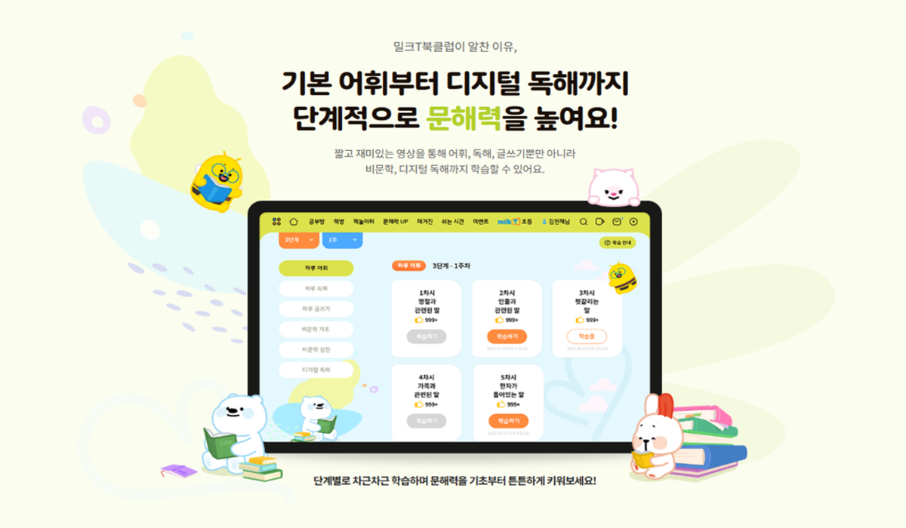
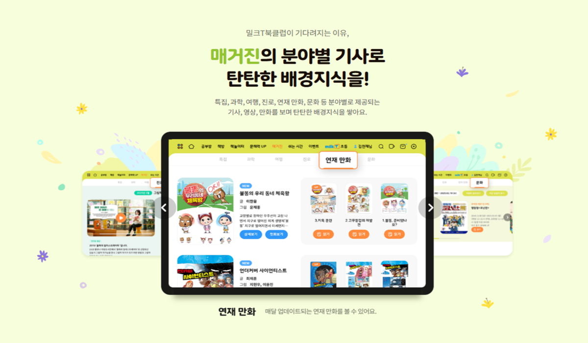

## References
- 📄 [My Resume](#) ← resume 링크로 교체
- 💼 [LinkedIn](#) ← LinkedIn 링크로 교체
  

## Work Experience

&nbsp;  
&nbsp; **Chunjae Education** &nbsp;|&nbsp; Backend Developer &nbsp;|&nbsp; 2021 – 2025  
&nbsp; Contributed to MilkT, a tablet-based digital learning platform serving K-12 students across South Korea.
  

## Service Overview

<table border="0"><tr>
<td> 
  Literacy learning: vocabulary, reading comprehension, and digital literacy</td>
<td> 
  Magazine feature: subject-based articles, videos, and serialized comics</td>
</tr></table>

MilkT delivers video lessons and an interactive question bank through a custom tablet app, with progress tracking for students and teachers.
[Visit MilkT Official Site](https://www.milkt.co.kr/bookclub/index)
  

## What I Built

### 1. Literacy Learning Feature
- Designed and implemented role-based content access, controlling what each student could view based on their membership type
- Developed the API between the hybrid tablet app and the media server to deliver the correct lesson content to students
- Built the database schema and tracked student learning sessions by recording playback position, total time spent, and completion status, enabling students to resume lessons from where they left off

### 2. Serialized Comics Feature
- Built a content management menu in the internal admin system, enabling the content team to independently upload and schedule weekly comic releases
- Developed the episode browsing and PDF playback feature on the hybrid tablet app, loading the correct episode based on each student's progress and access data
- Stored each student's reading history to resume from the last read episode
- Rewarded students with membership points upon first-time reading completion, which converted to store credit in the in-app store the following day

### 3. Event Features
- Developed seasonal event pages on the hybrid tablet app, managing each student's participation and submission data
- Implemented native gallery access via JavaScript Bridge, enabling students to upload photos directly from the tablet within the web-based app
- Built the reward logic to automatically distribute membership points to participants upon event completion

### 4. CRM / Internal Admin System
- Built an internal DB schema reference tool, allowing developers to browse table structures and descriptions without direct database access
- Added a student learning progress page to the CRM, enabling teachers to monitor each student's lesson completion and viewing history
- Developed an account permission management page, allowing staff to update user roles directly within the CRM
- Added a consultation memo feature for teachers to log and review notes from parent meetings within the CRM
- Built dashboard widgets displaying lecture view counts, completion rates, and progress distribution across students

### 5. Tech Stack Migration (POC)
- Converted features end-to-end as part of a team-wide migration of the internal content management system from C#/.NET to Java/MyBatis and Vue.js
- Connected the Vue.js frontend to the Java backend, handling content listing, search, and file management requests
- Restructured existing C# application logic to fit the Java/Vue.js architecture while preserving core business logic

### 6. Data Automation
- Built a self-service data extraction page, enabling non-technical staff to query and export data independently
- Automated recurring DB update tasks for teacher organization changes, eliminating the need for manual developer intervention

### 7. Information Security Compliance
- Applied data masking to sensitive personal information across the system ahead of annual security certification audits
  

## Tech Stack

  